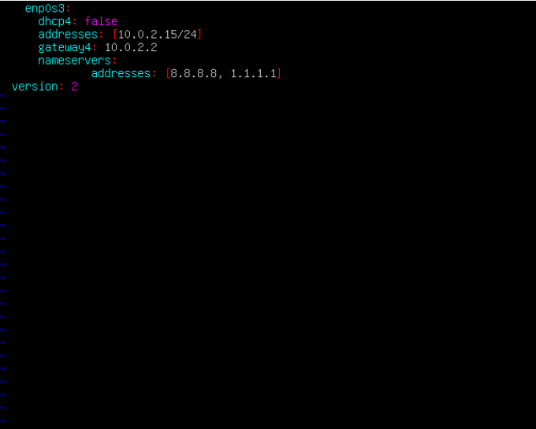

# Решение

1. [Установка ОС](#part-1-установка-ос)  
2. [Создание пользователя](#part-2-создание-пользователя)  
3. [Настройка сети ОС](#part-3-настройка-сети-ос)   
4. [Обновление ОС](#part-4-обновление-ос)  
5. [Использование команды  sudo](#part-5-использование-команды-sudo)  
6. [Установка и настройка службы времени](#part-6-установка-и-настройка-службы-времени)  
7. [Установка и использование текстовых редакторов](#part-7-установка-и-использование-текстовых-редакторов)  
8. [Установка и базовая настройка сервиса SSHD](#part-8-установка-и-базовая-настройка-сервиса-sshd)   
9. [Установка и использование утилит top, htop](#part-9-установка-и-использование-утилит-top-htop)   
10. [Использование утилиты fdisk](#part-10-использование-утилиты-fdisk)   
11. [Использование утилиты df](#part-11-использование-утилиты-df)    
12. [Использование утилиты du](#part-12-использование-утилиты-du)    
13. [Установка и использование утилиты ncdu](#part-13-установка-и-использование-утилиты-ncdu)    
14. [Работа с системными журналами](#part-14-работа-с-системными-журналами)     
15. [Использование планировщика заданий CRON](#part-15-использование-планировщика-заданий-cron)

## Part 1. Установка OC

**== Задание ==**

##### Установи **Ubuntu 20.04 Server LTS** без графического интерфейса. (Используем программу для виртуализации - VirtualBox)

- Графический интерфейс должен отсутствовать.

- Узнай версию Ubuntu, выполнив команду \
`cat /etc/issue.`
- Вставь скриншот с выводом команды.

**== Решение ==**

- Установим программу VirtualBox, скачав ее с официального сайта

    

- Скачаем образ **Ubuntu 20.04.6  Server LTS**   

    

- Результат выполнения команды `cat /etc/issue`:

    

## Part 2. Создание пользователя

**== Задание ==**

##### Создать пользователя, отличного от пользователя, который создавался при установке. Пользователь должен быть добавлен в группу `adm`.

- Вставьте скриншот вызова команды для создания пользователя.
- Новый пользователь должен быть в выводе команды \
`cat /etc/passwd`
- Вставьте скриншот с выводом команды.

**== Решение ==**

- Создадим нового пользователя `newchel` с помощью команды
    ```
    sudo useradd newchel
    ```

    

- Добавим нового пользователя в группу `adm` c помощью команды:
    ```
    sudo usermod -a -G adm newchel
    ```

    

- После ввода команды `cat /ets/passwd` замечаем, что новый пользователь добавлен

    


## Part 3. Настройка сети ОС

**== Задание ==**

##### Задать название машины вида user-1  
##### Установить временную зону, соответствующую вашему текущему местоположению.  
##### Вывести названия сетевых интерфейсов с помощью консольной команды.
- В отчёте дать объяснение наличию интерфейса lo.  
##### Используя консольную команду получить ip адрес устройства, на котором вы работаете, от DHCP сервера. 
- В отчёте дать расшифровку DHCP.  
##### Определить и вывести на экран внешний ip-адрес шлюза (ip) и внутренний IP-адрес шлюза, он же ip-адрес по умолчанию (gw). 
##### Задать статичные (заданные вручную, а не полученные от DHCP сервера) настройки ip, gw, dns (использовать публичный DNS серверы, например 1.1.1.1 или 8.8.8.8).  
##### Перезагрузить виртуальную машину. Убедиться, что статичные сетевые настройки (ip, gw, dns) соответствуют заданным в предыдущем пункте.  

- В отчёте опишите, что сделали для выполнения всех семи пунктов (можно как текстом, так и скриншотами).
- Успешно пропинговать удаленные хосты 1.1.1.1 и ya.ru и вставить в отчёт скрин с выводом команды. В выводе команды должна быть фраза "0% packet loss".

**== Решение ==**

- Узнаем нынешнее название машины при помощи команды `hostname`

    

- Установим новое имя: `user-1` с помощью команды

    ```
    sudo hostname user-1
    ```

- Проверим работу команды при помощи `hostname`

    

- После перезагрузки машины данное имя сбросится. Чтобы этого не произошло, воспользуемся командой
    ```
    sudo hostnamectl set-hostname user-1
    ```

    

- Название не изменилось.

---

- Для того, чтобы узнать установленную временную зону используем команду `date`

    

- Временная зона не соответствует нашей. Изменим ее с помощью команды
    ```
    sudo timedatectl set-timezone Europe/Moscow
    ```

    

---

- Чтобы вывести названия сетевых интерфейсов, воспользуемся коммандой:
    ```
    ip address
    ```
    

- >lo (loopback device) - виртуальный интерфейс, присутствующий по умолчанию в любом Linux. Он используется для отладки сетевых программ и запуска серверных приложений на локальной машине. С этим интерфейсом всегда связан адрес 127.0.0.1. У него есть dns-имя — localhost. Интерфейс lo является локальной петлёй. Она предназначена для обеспечения сетевого доступа к компьютеру.

---

- Чтобы узнать ip адрес машины, выданный ей DHCP сервером воспользуемся командой:
    ```
    ip r
    ```

    

- IP-адрес, выданный DHCP: 10.0.2.15/24.

- >DHCP (Dynamic Host Configuration Protocol) - протокол динамической конфигурации хоста. Сетевой протокол, позволяющий устройствам автоматически получать IP-адрес и другие параметры, необходимые для работы в сети TCP/IP. Данный протокол работает по модели «клиент-сервер». Для автоматической конфигурации компьютер-клиент на этапе конфигурации сетевого устройства обращается к так называемому серверу DHCP и получает от него нужные параметры. IP-адрес (Internet Protocol) - способ адресации устройств по сети.

---

- Чтобы узнать внешний ip-адрес шлюза (IP) воспользуемся командой:

    ```
    curl ipinfo.io/ip
    ```
    

- Чтобы определить и вывести на экран внутренний IP-адрес шлюза(gw), воспользуемся командой:
    ```
    ip route
    ```
    

- Внешний IP-адрес шлюза: 128.75.245.225; Внутренний: 10.0.2.2

---

- Откроем файл конфигурации `netplan` в текстовом редакторе `Vim` с помощью команды:

    ```
    sudo vim /etc/netplan/00-installer-config.yaml
    ```

    

- Для применения всех изменений в файле, используем команду:

    ```
    sudo netplan apply
    ```

- Перезапустим ВМ, чтобы проверить, сохранились ли изменения в файле. Чтобы проверить результат после перезапуска, введем команду:

    ```
    cat /etc/netplan/00-installer-config.yaml
    ```

    

--- 
- Пропингуем удаленные хосты 1.1.1.1 и ya.ru с помощью команд:

    ```
    ping 1.1.1.1 -c 3
    ```
    ```
    ping ya.ru -c 3
    ```

## Part 4. Обновление ОС

**== Задание ==**

##### Обновить системные пакеты до последней на момент выполнения задания версии.  

- После обновления системных пакетов, если ввести команду обновления повторно, должно появится сообщение, что обновления отсутствуют.
- Вставить скриншот с этим сообщением в отчёт.

**== Решение ==**
- Обновим индексы пактов и списки пакетов с помощью команды: 
    ```
    sudo apt update
    ```

- Обновим системные пакеты до последней версии, используя команду:
    ```
    sudo apt full-upgrade
    ```
    

- Проверяем то, что последняя версия установлена с помощью двух предыдущих команд

    

## Part 5. Использование команды **sudo**

**== Задание ==**

##### Разрешить пользователю, созданному в [Part 2](#part-2-создание-пользователя), выполнять команду sudo.

- В отчёте объяснить *истинное* назначение команды sudo (про то, что это слово - "волшебное", писать не стоит).  
- Поменять hostname ОС от имени пользователя, созданного в пункте [Part 2](#part-2-создание-пользователя) (используя sudo).
- Вставить скрин с изменённым hostname в отчёт.

**== Решение ==**

- Добавим пользователя, которого мы создали в [Part 2](#part-2-создание-пользователя), в группу `sudo`. Воспользуемся командой:
    ```
    sudo usermod -a -G sudo newchel
    ```

- Проверяем наличие пользователя при помощи команды:
    ```
    groups newchel
    ```

    

- >Sudo (Substitute user and do - подменить пользователя и выполнить) – это утилита для операционных систем семейства Linux, позволяющая пользователю запускать программы с привилегиями другой учётной записи, как правило, суперпользователя.

- Поменяем hostname от имени нового пользователя. Сменим пользователя при помощи команды:

    ```
    su newchel
    ```

- Изменим имя хоста с помощью команды:
    ```
    sudo hostnamectl set-hostname user-2
    ```

    

- Перезагрузим ВМ и убедимся, что название осталось таким же.

    


## Part 6. Установка и настройка службы времени

**== Задание ==**

##### Настроить службу автоматической синхронизации времени.  

- Вывести время, часового пояса, в котором вы сейчас находитесь.
- Вывод следующей команды должен содержать `NTPSynchronized=yes`: \
  `timedatectl show`
- Вставить скрины с корректным временем и выводом команды в отчёт.

**== Решение ==**

- Выведем текущее время с помощью команды `date` и настройки времени с помощью `timedatactl show`

    

- >На скриншоте видно, что вывод команды `timedatectl show` содержит `NTPSynchronized=yes`, это соответствует требованию задания. Данная запись свидетельствует о том, что протокол NTP (сетевой протокол времени) активен. NTP - это протокол, отвечающий за синхронизацию времени компьютера со стандартными эталонными часами через интернет с помощью иерархии серверов NTP.

## Part 7. Установка и использование текстовых редакторов 

**== Задание ==**

##### Установить текстовые редакторы **VIM** (+ любые два по желанию **NANO**, **MCEDIT**, **JOE** и т.д.)  
##### Используя каждый из трех выбранных редакторов, создайте файл *test_X.txt*, где X -- название редактора, в котором создан файл. Напишите в нём свой никнейм, закройте файл с сохранением изменений.  
- В отчёт вставьте скриншоты:
  - Из каждого редактора с содержимым файла перед закрытием.
- В отчёте укажите, что сделали для выхода с сохранением изменений.
##### Используя каждый из трех выбранных редакторов, откройте файл на редактирование, отредактируйте файл, заменив никнейм на строку "21 School 21", закройте файл без сохранения изменений.
- В отчёт вставьте скриншоты:
    - Из каждого редактора с содержимым файла после редактирования.
- В отчёте укажите, что сделали для выхода без сохранения изменений.
##### Используя каждый из трех выбранных редакторов, отредактируйте файл ещё раз (по аналогии с предыдущим пунктом), а затем освойте функции поиска по содержимому файла (слово) и замены слова на любое другое.
- В отчёт вставьте скриншоты:
    - Из каждого редактора с результатами поиска слова.
    - Из каждого редактора с командами, введёнными для замены слова на другое.

**== Решение ==**

- Установим текстовые редакторы командами:

    ```
    sudo apt install vim/nano/mcedit
    ```

### Запись никнейма в файлы и закрытие с сохранением

- VIM. Запишем никнейм `fastamel` , перейдя в режим редактирования нажатием клавиши `i`:

    

    - Для выхода с сохранением изменений нужно нажать `ESC`, затем написать `:wq`, что означает write and quit.

- NANO. Запишем никнейм `fastamel`:

    

    - Для выхода с сохранением изменений нужно нажать `Ctrl+S` и затем `Ctrl+X`.

- MCEDIT. Запишем никнейм `fastamel`:

    

    - Для выхода с сохранением изменений нужно нажать `F10` и выбрать `Yes`

---
### Запись "21 School 21" в файлы с выходом без сохранения

- VIM. Запишем "21 School 21":

    

    - Для выхода без сохранения нужно нажать `ESC`, затем написать `:q!`. Проверим, что изменения не сохранились:

    

- NANO. Запишем "21 School 21":

    

    - Для выхода без сохранения изменений нужно нажать `Ctrl+X` и подтвердить нажатием на `N`. Проверим, что изменения не сохранились:

    

- MCEDIT. Запишем "21 School 21":

    

    - Для выхода без сохранения изменений нужно нажать `F10` и выбрать `No`

    
    - Проверим, что изменения не сохранились:

    

---

### Поиск по слову в файлах
- Внесем изменения с предыдущего пункта (запишем в файлы "21 School 21") и сохраним их.

- **VIM**

    - Поиск:
    `ESC + /<слово_для_поиска>`
    
    

    - Замена:
    `:s/<заменяемое>/<заменитель>`

    

- **NANO**

    - Поиск:
    `Ctrl + W`
    
    

    - Замена:
    `Ctrl + \`

    

    - Вводим слово для замены:

    

    - Применяем замену:

    

- **MCEDIT**

    - Поиск:
    `F7`
    
    

    - Вводим и подтверждаем слово для поиска:

    

    - Замена:
    `F4`

    

    - Вводим и подтверждаем слово для замены:

    

## Part 8. Установка и базовая настройка сервиса **SSHD**

**== Задание ==**

##### Установить службу SSHd.  
##### Добавить автостарт службы при загрузке системы.  
##### Перенастроить службу SSHd на порт 2022.  
##### Используя команду ps, показать наличие процесса sshd. Для этого к команде нужно подобрать ключи.
- В отчёте объяснить значение команды и каждого ключа в ней.
##### Перезагрузить систему.
- В отчёте опишите, что сделали для выполнения всех пяти пунктов (можно как текстом, так и скриншотами).
- Вывод команды netstat -tan должен содержать  \
`tcp 0 0 0.0.0.0:2022 0.0.0.0:* LISTEN`  \
(если команды netstat нет, то ее нужно установить)
- Скрин с выводом команды вставить в отчёт.
- В отчёте объяснить значение ключей -tan, значение каждого столбца вывода, значение 0.0.0.0.

**== Решение ==**

- Установим службу SSHd
    ```
    sudo apt install openssh-server
    ```

- Автостарт SSHd добавлен автоматические при загрузке, что можно увидеть на скриншоте.

    

- Откроем файл `sshd_config` для перенастройки службы SSHd на порт 2022:

    ```
    sudo nano /etc/ssh/sshd_config
    ```

- Раскоментируем и изменим значение `Port` на 2022

    

- Перезапустим сервер `OpenSSH`, чтобы сохранить изменения, использовав команду:

    ```
    sudo systemctl restart ssh
    ```

- Проверим изменение порта.

    

- Покажем наличие процесса sshd, используя команду:
    ```
    ps aux | grep -i ssh
    ```
    

    - > **ps** - утилита для просмотра списка процессов в Linux. <br> Параметр `-a` - выбрать все процессы всех пользователей, кроме фоновых. 
    <br> Параметр `-u` обозначает ориентированный на пользователя формат, который предоставляет подробную информацию о процессах. 
    <br> Параметр `-x` указывает `ps` перечислить процессы без управляющего терминала.
    <br> В основном это процессы, которые запускаются во время загрузки и работают в фоновом режиме.
    <br> `grep -i ssh` - выводит только те строчки, где есть ssh с игнорированием регистра за счет `-i`.
    <br> Символ `|` перенаправляет вывод команды `ps aux` на ввод `grep -i ssh`.

- Выполним перезагрузку ВМ и выполним команду:
    ```
    netstat -tan
    ```

    

    - Как видно на скриншоте, вывод команды содержит `tcp 0 0 0.0.0.0:2022 0.0.0.0:* LISTEN`, что соответствует требованию задания.

    - >`netstat -tan`\
    \
    Команда `netstat` показывает статистику приема и отправки пакетов, а также информацию об ошибках приема и отправки.\
    \
    `-a` - Вывод всех активных подключений TCP и прослушиваемых компьютером портов TCP и UDP.\
    `-n` - Вывод активных подключений TCP с отображением адресов и номеров портов в числовом формате без попыток определения имен.\
    Тогда, если `netstat -na` - просмотр всех открытых протоколов, то `netstat -tan` - просмотр всех открытых ТСР-протоколов.\
    \
    При вызове команды в терминал выводится таблица, столбцы которой имеют следующие значения:\
    а) `Proto` - сетевой протокол (tcp, udp);\
    б) `Recv-Q` - количество байтов, помещённых в буфер приёма TCP/IP, но не переданных приложению. Если это число высокое, то нужно проверить работоспособность приложения, которое работает с данным портом.\
    в) `Send-Q` — количество байтов, помещённых в буфер отправки TCP/IP, но не отправленных, или отправленных, но не подтверждённых. Высокое значение может быть связано с перегрузкой сети сервера.\
    г) `Local Address` — локальный адрес сервера. В обычных соединениях, это адрес сервера на который пришло соединение. В прослушиваемых портах (LISTEN) — это диапазон адресов. Так 0.0.0.0:port — значит подключаться можно ко всем адресам сервера, а 192.168.0.35:port — значит подключаться можно только к этому адресу сервера.\
    д) `Foreign Address` — адрес второй стороны. В обычных соединениях, это адрес с которого пришло соединение. В прослушиваемых портах (LISTEN) — это диапазон адресов. Так 0.0.0.0:* — значит подключаться можно с любых адресов и с любых портов, а например 192.168.0.50:* — значит подключаться можно только с этого адреса и с любых портов.\
    е) `State` — состояние подключения, или прослушивания.

## Part 9. Установка и использование утилит **top**, **htop**

**== Задание ==**

##### Установить и запустить утилиты top и htop.  

- По выводу команды top определить и написать в отчёте:
  - uptime
  - количество авторизованных пользователей
  - общую загрузку системы
  - общее количество процессов
  - загрузку cpu
  - загрузку памяти
  - pid процесса занимающего больше всего памяти
  - pid процесса, занимающего больше всего процессорного времени

- В отчёт вставить скрин с выводом команды htop:
  - отсортированному по PID, PERCENT_CPU, PERCENT_MEM, TIME
  - отфильтрованному для процесса sshd
  - с процессом syslog, найденным, используя поиск 
  - с добавленным выводом hostname, clock и uptime

**== Решение ==**

- Запустим утилиту `top`

    
    - uptime - 34 минуты;
    - количество авторизованных пользователей - 1;
    - общую загрузку системы - 0.00, 0.04, 0.02;
    - общее количество процессов - 138;
    - загрузка cpu - 0.0 %;
    - загрузка памяти - 180.0 из 3919.0;
    - pid процесса занимающего больше всего памяти - 1;
    - pid процесса, занимающего больше всего процессорного времени - 713

- **htop** :
    - Вывод команды без сортировки

    
    
    - `htop` отсортированный по `PID`

    

    - `htop` отсортированный по `PERCENT_CPU`

    

    - `htop` отсортированный по `PERCENT_MEM`

    

    - `htop` отсортированный по `TIME`

    

    - Для использования фильтров в `htop` нужно нажать `F4` и выбрать параметр фильтрации.
    - htop, отфильтрованный для процесса SSHd

    

    - Для использования поиска в `htop` нужно нажать `F3` и ввести объект поиска. <br>
    `htop` с процессом `syslog`, найденным, используя поиск:

    

    - Для добавления отображения дополнительных параметров в `htop`, необходимо нажать `F2` и добавить требуемые параметры. `htop` с добавленным выводом hostname, clock и uptime

     
    
## Part 10. Использование утилиты **fdisk**

**== Задание ==**

##### Запустить команду fdisk -l.

- В отчёте написать название жесткого диска, его размер и количество секторов, а также размер swap.

**== Решение ==**

- Выполним команду:
    ```
    fdisk -l
    ```
    

    - Название жесткого диска: VBOX HARDDISK (/dev/sda);
    - Размер диска: 25 Гигабайт;
    - Количество секторов: 52428800;

- Чтобы узнать размер `swap` выполним команду:
    ```
    free -h
    ```
    

    - Размер swap - 2.2 Гб

## Part 11. Использование утилиты **df** 

**== Задание ==**

##### Запустить команду df.  
- В отчёте написать для корневого раздела (/):
  - размер раздела
  - размер занятого пространства
  - размер свободного пространства
  - процент использования
- Определить и написать в отчёт единицу измерения в выводе.  

##### Запустить команду df -Th.
- В отчёте написать для корневого раздела (/):
    - размер раздела
    - размер занятого пространства
    - размер свободного пространства
    - процент использования
- Определить и написать в отчёт тип файловой системы для раздела.

**== Решение ==**

- Выполним команду:
    ```
    df
    ```

    

    >Для корневого раздела (/):\
        - Размер раздела: 11758760;\
        - Размер занятого пространства: 5138960;\
        - Размер свободного пространства: 6000692;\
        - Процент использования: 47 %;\
        Единицы измерения при выводе: Килобайты.

    

    >Для корневого раздела (/):\
        - Размер раздела: 12;\
        - Размер занятого пространства: 5.0;\
        - Размер свободного пространства: 5.8;\
        - Процент использования: 46 %;\
        Единицы измерения при выводе: Гигабайты.

    Тип файловой системы: `Ext4` - журналируемая файловая система, используемая в ОС на ядре Linux. Основана на файловой системе Ext3, но отличается тем, что в ней представлен механизм записи файлов в непрерывные участки блоков (екстенты), уменьшающий фрагментацию и повышающий производительность. В ней есть журналирование, то есть в ней предусмотрена запись некоторых данных, позволяющих восстановить файловую систему при сбоях в работе компьютера.

## Part 12. Использование утилиты **du**

**== Задание ==**

##### Запустить команду du.
##### Вывести размер папок /home, /var, /var/log (в байтах, в человекочитаемом виде)
##### Вывести размер всего содержимого в /var/log (не общее, а каждого вложенного элемента, используя *)

- В отчёт вставить скрины с выводом всех использованных команд.

**== Решение ==**

- Выполним команду:
    ```
    du
    ```


    

- Вывод размера папки /home в байтах и в человекочитаемом виде командами:
    
    

- Вывод размера папки /var в байтах и в человекочитаемом виде командами:

    

- Вывод размера папки /var/log в байтах и в человекочитаемом виде командами:

    

- Вывод размера всего содержимого папки /var/log в байтах и в человекочитаемом виде командами:

    

- Вывод размера всего содержимого папки (каждого вложенного элемента) /var/log с использованием `*` командой:

    

## Part 13. Установка и использование утилиты **ncdu**

**== Задание ==**

##### Установить утилиту ncdu.
##### Вывести размер папок /home, /var, /var/log.

- Размеры должны примерно совпадать с полученными в [Part 12](#part-12-использование-утилиты-du).

- В отчёт вставить скрины с выводом использованных команд.

**== Решение ==**

- Установим утилиту

    

- Выведем размер папки `/home`:

    

- Выведем размер папки `/var`:

    

- Выведем размер папки `/var/log`:

    

## Part 14. Работа с системными журналами

**== Задание ==**

##### Открыть для просмотра:
##### 1. /var/log/dmesg
##### 2. /var/log/syslog
##### 3. /var/log/auth.log  

- Написать в отчёте время последней успешной авторизации, имя пользователя и метод входа в систему.
- Перезапустить службу SSHd.
- Вставить в отчёт скрин с сообщением о рестарте службы (искать в логах).

**== Решение ==**

- Откроем /var/log/dmesg

    

- Откроем /var/log/syslog

    

- Откроем /var/log/auth.log

    

- Время последней успешной авторизации: Sep 1, 21:36:33
- Имя пользователя: fastamel
- Метод входа в систему: by uid = 0;

- Перезапустим службу SSHd. В логах найдем сообщение о перезапуске службы:

    

## Part 15. Использование планировщика заданий **CRON**

**== Задание ==**

##### Используя планировщик заданий, запустите команду uptime через каждые 2 минуты.
- Найти в системных журналах строчки (минимум две в заданном временном диапазоне) о выполнении.
- Вывести на экран список текущих заданий для CRON.
- Вставить в отчёт скрины со строчками о выполнении и списком текущих задач.

##### Удалите все задания из планировщика заданий.
- В отчёт вставьте скрин со списком текущих заданий для CRON.

**== Решение ==**

- Будем запускать команду `uptime` каждые 2 минуты. Открываем планировщик `CRON` с помощью команды:

    ```
    crontab -e
    ```
- Добавим строчку `*/2 * * * * uptime`

    

- Убедимся, что uptime выполняется, для этого воспользуемся командой:
    ```
    less /var/log/syslog | grep CRON
    ```

    

- Проверим список задач `CRON`

    

- Удалим все задания из `CRON` с помощью команды:

    ```
    crontab -r
    ```

- Проверим список задач

    